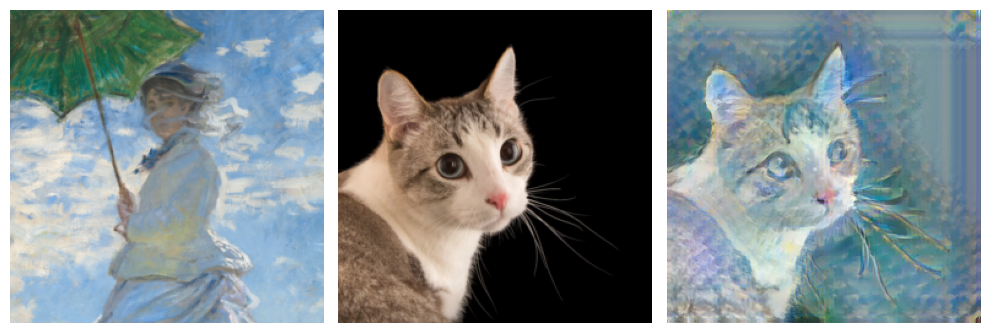
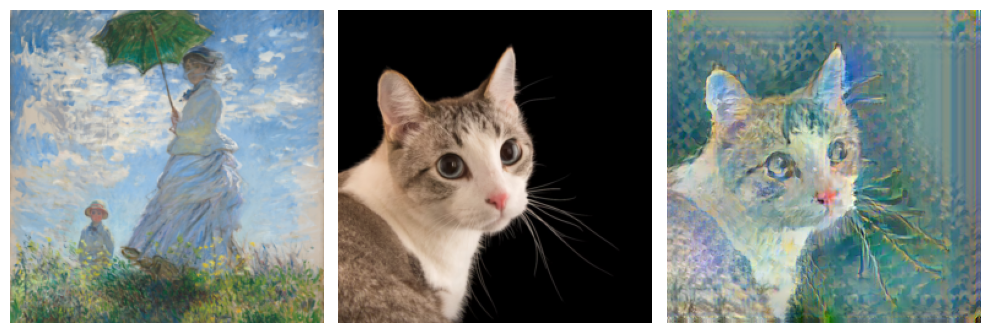
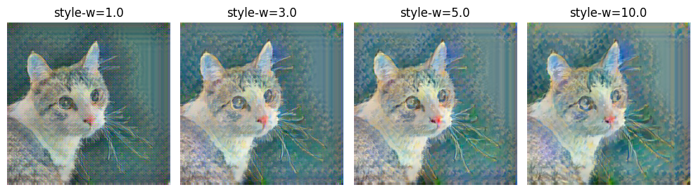
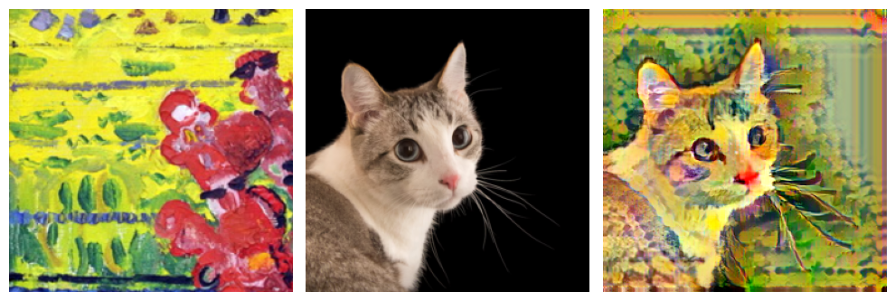
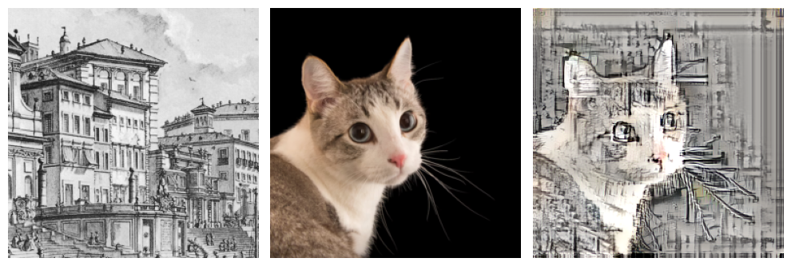
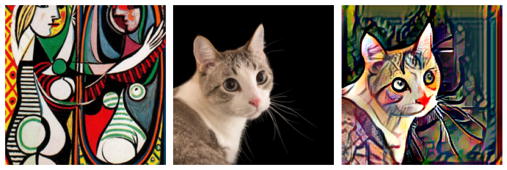
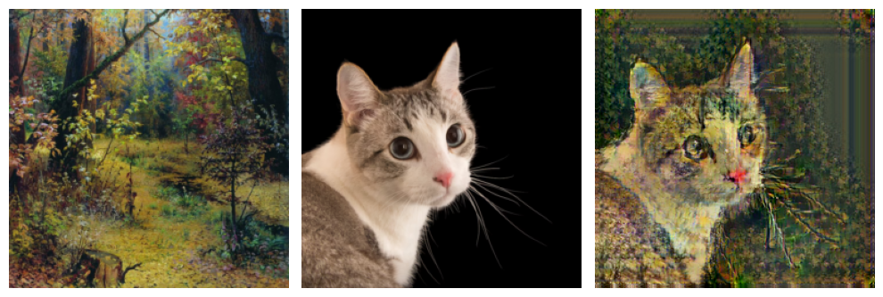

# Style Transfer Pytorch

implementation of the paper: arbitrary style transfer in real-time with adaptive instance normalization

## Sample Results

### different patch size

### different style weight

## More samples

## Data
prepare content images and style images, you can download style image from [here](https://www.kaggle.com/c/painter-by-numbers), for content image i use VOC12. you can use any content image you want.

## Training
use `run.sh` to run, you can change config in config file `configs/config.py`

you can find pretrained model with different style wright in [here](), in the link, the tensorboard log are uploaded too, you can check it locally.
## Testing
use `play.ipynb` to use pretrained model to do style transfer

## TODO

- [ ]  i do not add reflective pad in vgg model, so there will be artifacts in borders

## Reference

[https://github.com/naoto0804/pytorch-AdaIN](https://github.com/naoto0804/pytorch-AdaIN)